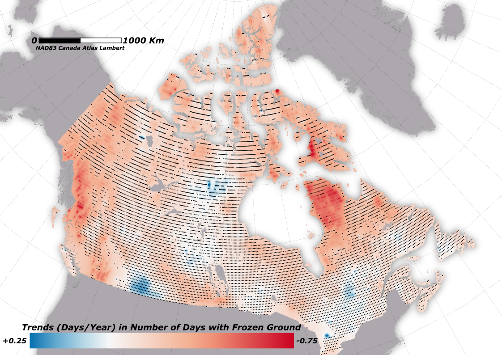

# canada-climate2024-soil-freezethaw

## Overview
This repository hosts the development of a comprehensive database leveraging the MEaSUREs Global Record of Daily Landscape Freeze/Thaw Status, Version 5, data. Our goal is to systematically track and analyze the monthly variations in soil freeze and thaw across Canada, starting from 1979 to 2021. This project, a collaborative effort led by the University of Quebec in Trois-Rivières, aims to provide valuable insights into changes in soil freeze-thaw cycles, potentially influencing agricultural practices, infrastructure development, and environmental policy in Canada.

The database will serve as a vital resource for researchers, policymakers, and the public, offering a detailed view of how changing climate patterns are affecting Canadian landscapes. We encourage contributions, suggestions, and collaborations to enhance the accuracy, accessibility, and applicability of this data for various stakeholders.

Key Features:
- Monthly soil freeze/thaw status tracking across Canada from 1979 onwards.
- Detailed tracking of monthly soil freeze and thaw across different landscapes in Canada, providing insights into regional variations and trends.
- Data visualization tools for easier interpretation of trends and patterns.
- Open access to data for research and educational purposes.
- Opportunities for community involvement in project development and enhancement.

## Features

- Feature 1
- Feature 2