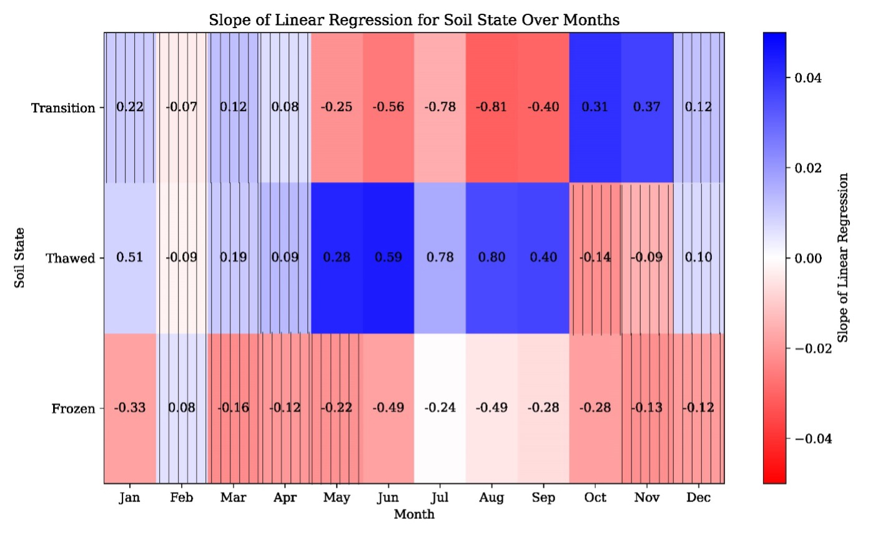

# Canada Changing Climate Report 2025: Frozen Ground 
## Overview
This project presents an in-depth analysis of soil freeze-thaw dynamics in Canada, exploring trends in frozen, unfrozen, and transitional soil states from 1979 to 2021. The study sheds light on significant climate-driven changes in soil states across different months, seasons, and vegetation covers.


**Caption**:
Trends in the annual number of days with frozen ground (DFG) from 1979 to 2021, calculated using the method outlined in (Li et al. 2021). The map visualizes the trend in the number of DFG, measured in days per year. Grid cells highlighted in blue indicate an increasing trend, while red grid cells signify a decreasing trend. Pixels with no significant trends (Mann-Kendall test with p-value of > 0.05) are displayed with “x”.
(Brief description: The figure shows that most of the regions in Canada has encountered a decrease in the number of frozen days from 1979 to 2021)


---

## Highlights and Figures

### 1. Trends in Frozen, Unfrozen, and Transitional Days (1979-2021)

**Highlights**:
- An increasing trend in the number of unfrozen days in Canada was observed (**p-value = 0.024**), alongside a decreasing trend in the number of frozen days (**p-value = 0.028**), while no significant trend in the number of transitional days was detected.
- Since 1979, there has been a notable **9.1% increase** in the number of unfrozen days.
- The number of unfrozen days exhibited a steady increase of **1.1% per decade** during the study period.
- The mean number of frozen, unfrozen, and transitional days for the study period were **148.15, 166.54, and 50.56**, respectively.


**Caption**: 
This figure presents a heatmap illustrating the slopes of the fitted linear regressions on the number of frozen, thawed, and transitional days for each month of the year from 1979 to 2021. The color gradient indicates trends, with red indicating a decreasing trend (negative slope) and blue indicating an increasing trend. Cells with gridded lines denote **p-values ≥ 0.1** in the Mann-Kendall test, suggesting no significant trend. The numbers within each cell represent the **correlation coefficient (r value)** of the fitted linear regression.

**Figure**:


---

### 2. Monthly Trends in Frozen, Unfrozen, and Transitional Days (1979-2021)

**Highlights**:
- Overall, with the exception of October and November, the number of unfrozen days has increased across all months during the study period. 
  - January, May, June, July, August, and September exhibit a **significant increasing trend (p-value ≤ 0.1)**.
  - The correlation coefficient (**r value**) for January, June, July, and August is significant (**r ≥ 0.5**).
- Across all months except February, there is a general decreasing trend in the number of frozen days.
- From October to April, there is an **increasing trend in transitional days**. From May to September, there is a **decreasing trend**.

**Caption**:
This figure presents a heatmap depicting the slopes of the fitted linear regression lines over the number of frozen, thawed, and transitional days across various vegetation covers in Canada from 1979 to 2021. The numbers displayed on each tile represent the correlation coefficient (**r value**) associated with the fitted regression line. Vertical lines indicate cases where the **p-value > 0.1**, suggesting no significant trend.


**Figure**:


---

### 3. Seasonal Probability Changes

**Highlights**:
- In November, the probability of thawed days **decreased significantly by ~10%**, while frozen days increased by **4%**, and transitional days increased by **6%**.
- From October to April, there was an **increase in the probability of transitional days**.
- During summer months, the probability of unfrozen days increased by **4%, 2%, and 4%** for June, July, and August, respectively.

**Caption**:
This figure illustrates the probability of occurrence for frozen, thawed, and transitional soil states during the **initial five years of the study period (1979-1984)** compared to the **latest five years (2016-2021)**.

**Figure**:


---

### 4. Trends in Frozen, Unfrozen, and Transitional Days Across Various Vegetation Covers in Canada (1979-2021)

**Highlights**:
- In the Tundra region, the number of unfrozen days has increased by **28%** since 1979, while the number of transitional days has decreased by **25%**. These changes suggest an extension of the unfrozen season into the shoulder season in the Tundra. Additionally, the number of frozen days has decreased by around **6%**, indicating a shortening of the frozen period in the Tundra.
- For all other vegetation covers, including Boreal forest, temperate forest, and prairies, the number of unfrozen days has increased at a more moderate rate, approximately 6% since 1979. However, the increasing trend is statistically significant for the temperate forest cover only. 


**Caption**:
This figure presents a heatmap depicting the slopes of the fitted linear regression lines over the number of frozen, thawed, and transitional days across various vegetation covers in Canada from 1979 to 2021. The numbers displayed on each tile represent the correlation coefficient (r value) associated with the fitted regression line. Vertical lines indicate cases where the p-value of the trend line is not statistically significant (p-value > 0.1).

**Figure**:


---

### 5. Interannual Variations in Tundra Region

**Highlights**:
- The number of unfrozen days in the Tundra region increased by **27 days** (almost one month) in 2021 compared to 1979. This suggests that the unfrozen season in the Tundra is now approximately one month longer than it was in 1979.
- The rate of increase in the number of unfrozen days in the Tundra is approximately **4%** every decade.


**Caption**:
This figure illustrates the **interannual variations in the number of unfrozen days** across the Tundra region in Canada from 1979 to 2021.

**Figure**:


---

### 5. Fluctuations in Frozen Days Across Canada (1979-2021)

**Highlights**:
- The annual number of days with frozen ground has decreased across Canada. 
- Satellite observations consistently show a reduction in the number of days with frozen ground, occurring at a rate of 1.7 days per decade since 1979.


**Caption**:
The annual difference over Canada in number of days with frozen ground (DFG) from the 1979-2021 average using the method outlined in US-EPA (2023). Each bar represents the deviation from the average number of days for a given year, with positive values indicating years with more frozen days than the average. The trend line (Black) depicts the ordinary least-squares linear regression, providing insight into the overall trend. (Brief description: The figure shows that the number of frozen days as decreased by 1,7 days per decade over Canada from 1979 to 2021)

**Figure**:


---

---

### 5. Annual Mean of Days with Frozen Ground (2000-2020) 

**Caption**:


**Figure**:


---

## Data
The dataset used in this study is the **Freeze/Thaw Earth System Data Record (FT-ESDR, 1979–2021)**, available at the [NSIDC](https://nsidc.org/data/nsidc-0477/versions/5). Key features:
- **Frozen/Thawed Classification**:
  - Based on microwave brightness temperatures compared to grid-specific thresholds using the **Modified Seasonal Threshold Algorithm (MSTA)**.
- **Preprocessing**:
  - Excluded pixels with:
    - Open water fraction >20%.
    - Elevation gradient >300m.

## Methodology
- **Trend Detection**:
  - Used the **Mann-Kendall trend test** to identify monotonic trends in frozen, thawed, and transitional days.
  - Calculated **linear regression slopes** for statistically significant pixels (**p-value ≤ 0.05**).
- **Data Analysis**:
  - Combined AM and PM satellite overpass data to classify soil states:
    - **Frozen**: AM or PM frozen.
    - **Thawed**: Both AM and PM thawed.
    - **Transitional**: Mixed states (AM frozen, PM thawed, or vice versa).

---

## How to Use This Project
1. Clone the repository:
   ```bash
   git clone https://github.com/yourusername/canada-climate2024-soil-freezethaw.git